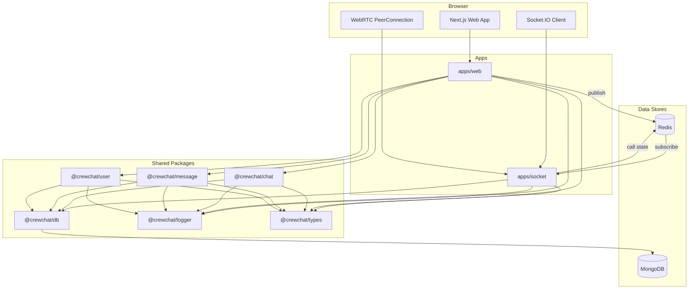
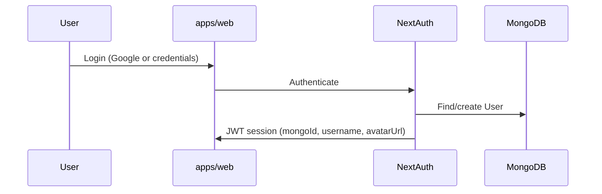
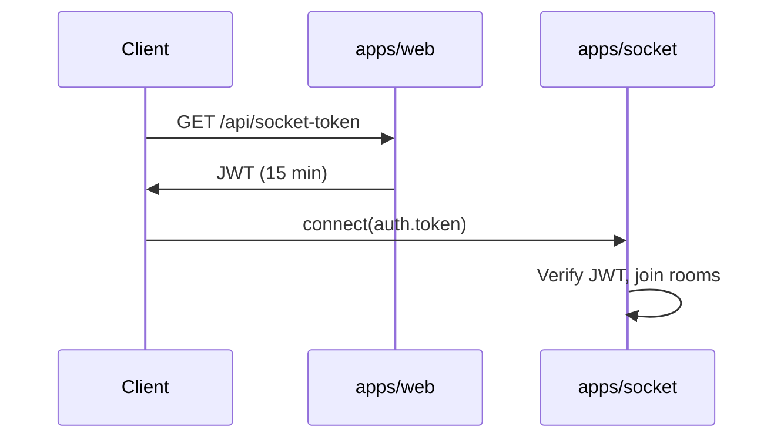
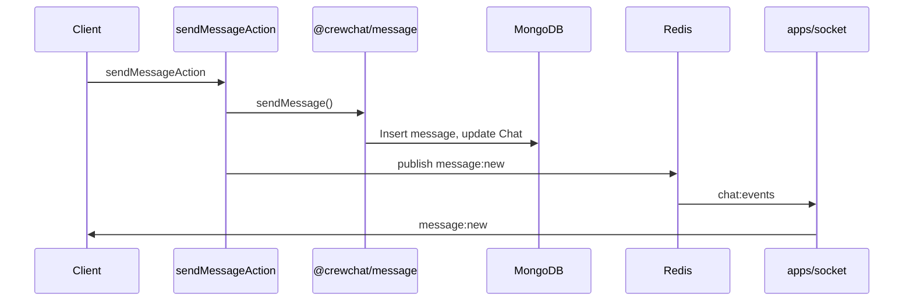

# Architecture

High-level system design for CrewChat. For detailed module docs, see the [documentation index](./README.md).

## System overview

CrewChat is a **pnpm monorepo** with two runnable apps and four shared domain packages. Business logic lives in `packages/*`; apps are thin orchestration layers.

## Components

### `apps/web` — Next.js application

| Concern | Technology |
|---------|------------|
| UI | Next.js 16 App Router, React 19, Tailwind CSS v4 |
| Auth | NextAuth v5 (Google OAuth + credentials) |
| Server logic | Server actions → `@crewchat/*` packages |
| Client state | Zustand + Immer |
| Realtime client | Socket.IO client |
| Calls | WebRTC with Socket.IO signaling |

Issues short-lived JWTs via `/api/socket-token` for socket authentication. Publishes message events to Redis after persisting to MongoDB.

→ [Web app documentation](./WEB_APP.md)

### `apps/socket` — Realtime gateway

| Concern | Technology |
|---------|------------|
| Transport | Express + Socket.IO |
| Auth | JWT middleware (`SOCKET_JWT_SECRET`) |
| Coordination | Redis pub/sub + call state |
| DB access | Read-only membership queries |

Does not persist messages. Relays chat events from Redis, manages call state, and forwards WebRTC signaling.

→ [Socket server documentation](./SOCKET_SERVER.md)

### `packages/db` — Database layer

Mongoose models: `User`, `Chat`, `Message`, `UserChatMetaData`. Exports `connectToDB()` with a global connection cache (safe for Next.js hot reload).

→ [Data model](./DATA_MODEL.md)

### `packages/chat`, `message`, `user` — Domain logic

Pure functions used by both web server actions and (read-only) socket handlers. Keeps DB shape and UI decoupled.

→ [Packages documentation](./PACKAGES.md)

## Request flows

### Sign-in

→ [Authentication](./AUTH.md)

### Realtime connection

### Send message

→ [Realtime events](./REALTIME.md)

### Voice/video call

1. Caller emits `call:start` via socket
2. Socket creates call in Redis, notifies callee
3. Callee accepts → both join `call:{callId}` room
4. WebRTC offer/answer/ICE relayed through socket
5. Either party emits `call:end` → Redis cleanup

→ [Socket server — calls](./SOCKET_SERVER.md#call-signaling)

## Data stores

| Store | Role | Persistence |
|-------|------|-------------|
| **MongoDB** | Source of truth: users, chats, messages, per-user chat metadata | Durable |
| **Redis** | Socket pub/sub bridge, ephemeral call state | Ephemeral (TTL) |

### Membership model

Chat membership is tracked exclusively in `UserChatMetaData` (there is no `Chat.members` array). This supports per-user preferences (pin, mute, read receipts) and group admin roles.

### Denormalized lastMessage

`Chat.lastMessage` is a snapshot updated on send/edit/delete. Avoids expensive aggregation on every chat list load.

## Auth modes

The codebase supports two socket auth strategies:

| Mode | When to use | Middleware |
|------|-------------|------------|
| **JWT** (default) | Web and socket on different origins | `authMiddlewareJWT` |
| **Cookie** | Web and socket share a domain | `authMiddlewareCookie` |

→ [Authentication](./AUTH.md)

## Scaling

| Component | Strategy |
|-----------|----------|
| Web app | Stateless; scale horizontally behind load balancer |
| Socket server | Multiple instances share Redis pub/sub; call state in Redis |
| MongoDB | Replica set; index growth fields as data scales |
| Redis | Shared instance required for multi-socket deployment |

→ [Deployment](./DEPLOYMENT.md)

## Design principles

1. **Domain logic in packages** — apps orchestrate, packages implement
2. **Persist then publish** — write to MongoDB first, then Redis for realtime
3. **Membership via UserChatMetaData** — single source of truth for access control
4. **Thin handlers** — socket handlers validate and relay; no business logic duplication
5. **JWT socket auth** — separate short-lived token for cross-origin socket connections

## Related documentation

| Document | Topics |
|----------|--------|
| [Data model](./DATA_MODEL.md) | Schemas, indexes, relationships |
| [Packages](./PACKAGES.md) | Domain function reference |
| [Web app](./WEB_APP.md) | Routes, actions, stores, components |
| [Socket server](./SOCKET_SERVER.md) | Events, calls, WebRTC |
| [Realtime](./REALTIME.md) | Event catalog, pub/sub |
| [Authentication](./AUTH.md) | NextAuth, socket tokens |
| [Development](./DEVELOPMENT.md) | Local setup, CI, conventions |
| [Deployment](./DEPLOYMENT.md) | Production topology |
