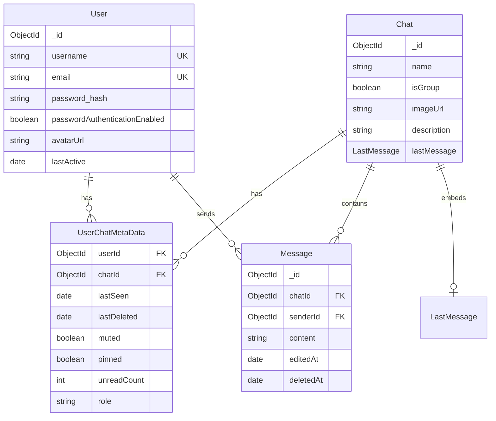

# Data Model

CrewChat stores persistent data in **MongoDB** via Mongoose. Ephemeral call state and socket coordination use **Redis** (not covered here — see [Socket server](./SOCKET_SERVER.md)).

All models are defined in `packages/db/src/schemas/` and exported from `@crewchat/db`.

## Entity relationship overview



## User (`users` collection)

**File:** `packages/db/src/schemas/user.schema.ts`

| Field | Type | Constraints | Notes |
|-------|------|-------------|-------|
| `username` | String | required, unique | 3–20 chars enforced in app layer |
| `email` | String | required, unique | Stored lowercase |
| `password_hash` | String | optional | `null` for OAuth-only users |
| `passwordAuthenticationEnabled` | Boolean | default `false` | Must be `true` for credentials login |
| `avatarUrl` | String | optional | URL or preset path |
| `lastActive` | Date | optional | Updated on sign-in |
| `createdAt` / `updatedAt` | Date | auto | Mongoose timestamps |

**Indexes:** implicit unique indexes on `username` and `email`.

## Chat (`chats` collection)

**File:** `packages/db/src/schemas/chat.schema.ts`

| Field | Type | Constraints | Notes |
|-------|------|-------------|-------|
| `name` | String | optional | Group name; DMs resolve display name from other user |
| `isGroup` | Boolean | required | `false` for DMs |
| `imageUrl` | String | optional | Group avatar |
| `description` | String | optional | Group description |
| `lastMessage` | embedded | optional | Denormalized snapshot for chat list |
| `createdAt` / `updatedAt` | Date | auto | `updatedAt` bumped on new messages |

### Embedded `lastMessage`

| Sub-field | Type | Notes |
|-----------|------|-------|
| `_id` | ObjectId | Message ID |
| `senderId` | ObjectId | ref User |
| `content` | String | `null` when deleted |
| `editedAt` | Date | `null` if never edited |
| `deletedAt` | Date | `null` if not deleted |
| `createdAt` | Date | Original message timestamp |

**Indexes:**
- `{ updatedAt: -1 }`

## Message (`messages` collection)

**File:** `packages/db/src/schemas/message.schema.ts`

| Field | Type | Constraints | Notes |
|-------|------|-------------|-------|
| `chatId` | ObjectId | required, indexed, ref Chat | |
| `senderId` | ObjectId | required, ref User | |
| `content` | String | required, max 2000 | Blanked in reads when soft-deleted |
| `editedAt` | Date | default `null` | Set on edit |
| `deletedAt` | Date | default `null` | Soft delete marker |
| `createdAt` / `updatedAt` | Date | auto | Pagination cursor uses `createdAt` |

**Indexes:**
- `{ chatId: 1 }` (field-level)
- `{ chatId: 1, createdAt: -1 }` (compound, for paginated history)

## UserChatMetaData (`userchatmetadatas` collection)

**File:** `packages/db/src/schemas/userChatMetaData.schema.ts`

Per-user, per-chat state. **This is the authority for membership** — especially for groups, where `Chat.members` may not be populated.

| Field | Type | Constraints | Notes |
|-------|------|-------------|-------|
| `userId` | ObjectId | required, ref User | |
| `chatId` | ObjectId | required, ref Chat | |
| `lastSeen` | Date | default `null` | Read receipt; drives unread counts |
| `lastDeleted` | Date | default `null` | Hides messages before this timestamp |
| `muted` | Boolean | default `false` | Per-user mute |
| `pinned` | Boolean | default `false` | Per-user pin |
| `unreadCount` | Number | default `0` | Pre-computed unread message count |
| `role` | String | enum: `role` | App uses `admin` / `member` only |
| `createdAt` / `updatedAt` | Date | auto | |

**Indexes:**
- `{ userId: 1, chatId: 1 }` — **unique** (one row per user per chat)
- `{ userId: 1, pinned: -1 }` — chat list sort

## Design decisions

### Membership via UserChatMetaData

Group creation writes `UserChatMetaData` rows for the owner (`admin`) and each member (`member`). All membership checks (`sendMessage`, `getMessages`, socket room joins) query `UserChatMetaData`. `Chat.members` does not exist in the schema.

### Denormalized lastMessage

`Chat.lastMessage` is a snapshot updated by `sendMessage`, `editMessage`, and `deleteMessage` (via internal `updateLastMessageIfMatches`). This avoids aggregation on every chat list load.

### Soft deletes

Messages are never hard-deleted. `deletedAt` is set; `getMessages` returns empty `content` for deleted messages. Admins can delete others' messages in groups.

### Unread count calculation

`UserChatMetaData.unreadCount` is precomputed. It is incremented atomically on `sendMessage` for all other members of the chat, and is reset to `0` on `markChatAsRead`.

## Connection helper

```typescript
import { withDB } from "@crewchat/db";

export const myAction = withDB(async () => {
  // DB connection is automatically established and pooled
});
```

`connectToDB` (negotiated by `withDB`) uses a global singleton cache safe for Next.js hot reload, and supports pool configuration via `MONGODB_MAX_POOL_SIZE` and `MONGODB_MIN_POOL_SIZE`.
