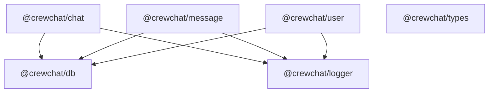

# Domain Packages

Six workspace packages under `packages/` implement all shared business logic. Both `apps/web` (server actions) and `apps/socket` (read-only membership queries) consume them.

## Dependency graph



There are **no direct dependencies** between `chat`, `message`, and `user`. The application layer orchestrates cross-domain operations (e.g. create user, then create DM).

| Package | NPM name | Purpose |
|---------|----------|---------|
| `db` | `@crewchat/db` | Mongoose models, `connectToDB()`, `withDB()` |
| `logger` | `@crewchat/logger` | Shared Pino structured logging |
| `types` | `@crewchat/types` | Shared DTOs and API payload types |
| `chat` | `@crewchat/chat` | Chat creation, membership, preferences |
| `message` | `@crewchat/message` | Message CRUD and pagination |
| `user` | `@crewchat/user` | User accounts, search, profile |

Build order matters: `db` must be built before the others (`pnpm build:db`).

---

## `@crewchat/db`

**Entry:** `packages/db/src/index.ts`

### Exports

| Export | Source |
|--------|--------|
| `UserModel` | `schemas/user.schema.ts` |
| `ChatModel` | `schemas/chat.schema.ts` |
| `MessageModel` | `schemas/message.schema.ts` |
| `UserChatMetaDataModel` | `schemas/userChatMetaData.schema.ts` |
| `connectToDB(uri)` | `connect.ts` |

TypeScript interfaces (`IUser`, `IChat`, etc.) exist in schema files but are not re-exported from the package entry.

See [Data model](./DATA_MODEL.md) for schema details.

---

## `@crewchat/chat`

**Entry:** `packages/chat/src/index.ts`

### Exports

| Function | File | Description |
|----------|------|-------------|
| `createDM` | `createDM.ts` | Create or return existing DM between two users |
| `DMExists` | `createDM.ts` | Check if DM already exists |
| `createGroup` | `createGroup.ts` | Create group chat with owner + members |
| `getChats` | `getChats.ts` | Chat list with unread counts, DM display names |
| `getChatPreviewById` | `getChats.ts` | Minimal preview for a single chat |
| `getChatDetails` | `getChatDetails.ts` | Full chat info including DM partner details |
| `getChatMembers` | `getChatMembers.ts` | Member list with roles |
| `addMembers` | `addMember.ts` | Add users to a group (admin only) |
| `removeMember` | `removeMember.ts` | Remove member or self-remove |
| `leaveGroup` | `leaveGroup.ts` | Leave a group |
| `changeMemberRole` | `changeRole.ts` | Promote/demote admin |
| `togglePin` | `togglePin.ts` | Pin/unpin chat for user |
| `toggleMute` | `toggleMute.ts` | Mute/unmute chat for user |
| `markChatAsRead` | `markChatAsRead.ts` | Set `lastSeen` to now |

### Key behaviors

**`createDM({ userId, otherUserId })`**
- Throws if `userId === otherUserId`
- Returns existing chat ID if DM already exists
- Creates `Chat` (isGroup: false) + two `UserChatMetaData` rows

**`createGroup({ ownerId, name, imageUrl?, description, memberIds })`**
- Throws if name is blank
- Owner gets `role: "admin"`; members get `role: "member"`
- Does not set `Chat.members`

**`getChats(userId)`**
- Sorted by pinned DESC, then `updatedAt` DESC
- For DMs: resolves `name` and `imageUrl` from the other user
- Reads pre-computed `unreadCount` directly from `UserChatMetaData` (updated atomically on message send)

**`addMembers({ chatId, actorId, userIdsToAdd })`**
- Rejects DMs, non-admins
- Idempotent: skips users already in chat
- Returns `{ addedCount, skippedCount }`

**`removeMember` / `leaveGroup`**
- Cannot remove the last admin
- Cannot leave a DM

---

## `@crewchat/message`

**Entry:** `packages/message/src/index.ts`

### Exports

| Function | File | Description |
|----------|------|-------------|
| `sendMessage` | `sendMessage.ts` | Create message, update `Chat.lastMessage` |
| `getMessages` | `getMessages.ts` | Paginated history (newest first) |
| `editMessage` | `editMessage.ts` | Edit own message, sync lastMessage |
| `deleteMessage` | `deleteMessage.ts` | Soft-delete (sender or admin) |

### Key behaviors

**`sendMessage({ chatId, senderId, content })`**
- Validates trimmed content (1–2000 chars)
- Requires membership via `UserChatMetaData`
- Updates `Chat.lastMessage` snapshot and `Chat.updatedAt`

**`getMessages({ chatId, userId, limit, cursor? })`**
- `cursor` is a `createdAt` Date for pagination
- Deleted messages return empty `content`
- Requires membership

**`editMessage({ messageId, userId, content })`**
- Sender only; rejects already-deleted messages
- Syncs `Chat.lastMessage` if it matches

**`deleteMessage({ messageId, userId })`**
- Sender or chat admin can delete
- Sets `deletedAt`; syncs `Chat.lastMessage` with `content: null`

### Internal helper

`updateLastMessageIfMatches` in `updateLastMessage.ts` is used by edit/delete but not exported.

---

## `@crewchat/user`

**Entry:** `packages/user/src/index.ts`

### Exports

| Function | File | Description |
|----------|------|-------------|
| `createUser` | `createUser.ts` | Create user (trimmed username, lowercase email) |
| `getUserById` | `getUserById.ts` | Fetch user by ID |
| `searchUsers` | `searchUsers.ts` | Prefix search on username/email |
| `updatePasswordAuthStatus` | `updatePasswordAuthStatus.ts` | Enable/disable password login |
| `updateUsername` | `updateUsername.ts` | Change username with validation |
| `getUserProfileDetails` | `getUserProfileDetails.ts` | Full profile for settings page |

### Key behaviors

**`searchUsers({ query, excludeEmail?, limit? })`**
- Returns `[]` for blank query
- Prefix regex match (`^query`, case-insensitive)
- Default limit: 10

**`updateUsername({ userId, username })`**
- 3–20 chars, `[a-zA-Z0-9_]+` only
- Returns `{ success: false }` if username taken

**`updatePasswordAuthStatus(userId, enabled, password)`**
- Asserts that the password is a valid bcrypt hash prefix (`$2b$`)
- Safely sets `password_hash` to `null` when disabling

---

## Usage pattern

```typescript
import { withDB } from "@crewchat/db";
import { sendMessage } from "@crewchat/message";
import { getChats } from "@crewchat/chat";

// Wrap server actions or commands to auto-connect to database
export const myAction = withDB(async (chatId, userId) => {
  const chats = await getChats(userId);
  const message = await sendMessage({ chatId, senderId: userId, content: "Hello" });
  return { chats, message };
});
```

Always ensure database connection before querying packages. Server actions do this automatically via `withDB`; the socket server connects at startup.

## Cross-package data flow

| Concern | Models | Package |
|---------|--------|---------|
| User accounts | `UserModel` | `user` |
| Chat creation & membership | `ChatModel`, `UserChatMetaDataModel` | `chat` |
| Messaging | `MessageModel`, `ChatModel.lastMessage` | `message` |
| Unread counts | `UserChatMetaDataModel.unreadCount` | `chat` (`getChats`) |
| Read receipts | `UserChatMetaDataModel.lastSeen` | `chat` (`markChatAsRead`) |
