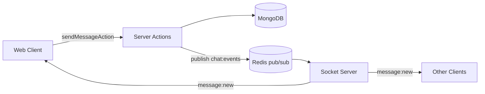
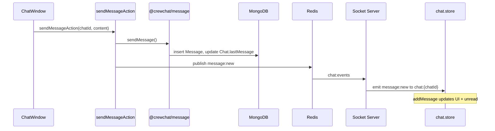
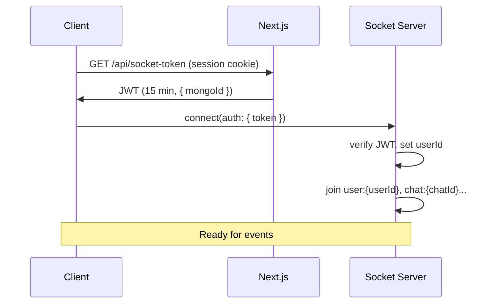

# Realtime Events

CrewChat uses a **persist-then-publish** pattern for messages: the web app writes to MongoDB via server actions, then publishes to Redis. The socket server subscribes and fans out to connected clients via Socket.IO.

## Architecture



This design allows horizontal scaling: multiple socket instances share one Redis channel.

## Redis channels

| Channel | Publisher | Subscriber | Events |
|---------|-----------|------------|--------|
| `chat:events` | `apps/web/lib/actions/message.actions.ts` | `apps/socket` | `message:new`, `message:edit`, `message:delete` |
| `user:events` | `apps/web/lib/userEvents.ts` | `apps/socket` | `chat:join`, `chat:join:many`, `chat:leave` |

### Message format

```typescript
{
  channel: "chat:events",
  type: "message:new" | "message:edit" | "message:delete",
  payload: { ... }
}
```

Published as a JSON string via `redis.publish("chat:events", JSON.stringify(event))`.

## Socket.IO event catalog

### Chat events (Redis → client)

Handled by `apps/socket/src/handlers/chatEventHandler.ts`, emitted to room `chat:{chatId}`.

| Event | Payload | Trigger |
|-------|---------|---------|
| `message:new` | See below | After `sendMessageAction` |
| `message:edit` | `{ chatId, messageId, content }` | After `editMessageAction` |
| `message:delete` | `{ chatId, messageId }` | After `deleteMessageAction` |

**`message:new` payload:**

```typescript
{
  messageId: string;
  chatId: string;
  senderId: string;
  content: string;
  createdAt: string;      // ISO 8601
  editedAt: string | null;
  deletedAt: string | null;
}
```

**Client handler** (`SocketProvider.tsx`):
- `message:new` → `useChatStore.addMessage`
- `message:edit` → `useChatStore.updateMessage`
- `message:delete` → `useChatStore.deleteMessage`

### User status events (Redis → client)

Handled by `apps/socket/src/handlers/userEventHandler.ts`.

| Event | Payload | Redis type |
|-------|---------|------------|
| `user:status` | `{ status: string }` | `user:status:update` |

No publisher exists in the codebase yet — the handler is wired but unused.

### Call events (client ↔ server)

See [Socket server](./SOCKET_SERVER.md#call-signaling) for full details.

| Direction | Events |
|-----------|--------|
| Client → Server | `call:start`, `call:accept`, `call:end` |
| Server → Client | `call:outgoing`, `call:incoming`, `call:connected`, `call:ended`, `call:resume` |

**Client store** (`call.store.ts`): `incomingCall`, `startCall`, `connectCall`, `resumeCall`, `endCall`.

### WebRTC events (client ↔ server)

Relay only — no server-side SDP inspection.

| Direction | Events |
|-----------|--------|
| Client → Server | `webrtc:offer`, `webrtc:answer`, `webrtc:ice` |
| Server → Client | Same events, relayed to peer in `call:{callId}` room |

**Client store** (`webrtc.store.ts`): `pushSignal`, `clearSignal`.

## Message send flow



## Socket connection flow



Token refresh: clients should re-fetch `/api/socket-token` before reconnecting after expiry.

## Room membership

Users are joined to chat rooms **eagerly on connect** via `getAllChatIds(userId)`. There is no lazy `chat:open` join (handler exists but is unwired).

Implications:
- Users receive events for all their chats, even when not viewing them (unread counts update)
- Adding a new chat requires reconnect or a future `chat:join` event to receive messages

## Scaling notes

- All socket instances subscribe to the same Redis channels
- Call state is in Redis with TTL — safe across instances
- Presence (callee online) uses Socket.IO adapter room sizes, not Redis
- For multi-region deployment, ensure Redis and MongoDB are co-located with socket instances

## Adding a new realtime event

1. Define the event type and payload shape
2. If persistence is needed: add domain logic in `packages/*`, call from a server action
3. Publish to Redis from the server action (`lib/redis.ts`)
4. Add a handler in `apps/socket/src/handlers/` (or extend `chatEventHandler.ts`)
5. Register in `redis.handler.ts` if new channel
6. Add listener in `SocketProvider.tsx` and update the relevant Zustand store
