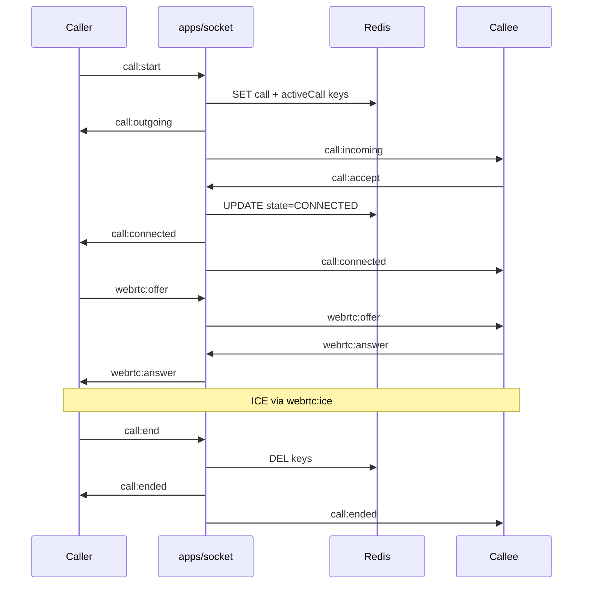

# Socket Server (`apps/socket`)

Express HTTP server with Socket.IO — handles realtime event delivery, voice/video call signaling, and WebRTC relay. Does **not** persist messages; the web app writes to MongoDB and publishes to Redis.

## Bootstrap

**Entry:** `apps/socket/src/index.ts`

```
dotenv → validate env → Express + GET /health
  → connectRedis(REDIS_URL)
  → connectToDB(MONGODB_URI)
  → http.createServer(app)
  → new Server(httpServer, { cors })
  → io.use(authMiddlewareJWT)
  → registerConnectionHandler(io, redis)
  → registerRedisHandlers(io)
  → httpServer.listen(PORT)
```

### Environment variables

| Variable | Required | Default | Purpose |
|----------|----------|---------|---------|
| `PORT` | No | `3001` | Listen port |
| `CLIENT_ORIGIN` | Yes | — | CORS origin (must match web `AUTH_URL`) |
| `REDIS_URL` | Yes | — | Pub/sub + call state |
| `MONGODB_URI` | Yes | — | Membership queries |
| `AUTH_SECRET` | Yes | — | Validated at startup (cookie auth) |
| `SOCKET_JWT_SECRET` | Yes | — | Socket JWT verification |

Sample: `apps/socket/.env.sample`

### Graceful shutdown

On `SIGTERM` / `SIGINT`:
1. Close HTTP server
2. Quit Redis clients (`redis`, `redisSub`)
3. `mongoose.disconnect()`
4. `process.exit(0)`

Set a 10–30s stop grace period on your platform.

### Docker

```bash
docker build -f apps/socket/Dockerfile -t crewchat-socket .
docker run --env-file apps/socket/.env -p 3001:3001 crewchat-socket
```

## Authentication

**File:** `apps/socket/src/middleware/auth.middleware.ts`

### Active: JWT middleware

```
Client connects with handshake.auth.token
  → jwt.verify(token, SOCKET_JWT_SECRET)
  → payload: { mongoId }
  → socket.data.userId = mongoId
  → next()
```

Token is issued by `apps/web/app/api/socket-token/route.ts` (15-minute expiry).

On failure: `next(new Error("Unauthorized"))` — connection rejected.

### Alternate: Cookie middleware (not active)

`authMiddlewareCookie` reads NextAuth JWT from cookies. Use when web and socket share a domain. Switch in `index.ts`:

```typescript
io.use(authMiddlewareCookie);  // instead of authMiddlewareJWT
```

See [Authentication](./AUTH.md) for the full flow.

## Room naming

| Pattern | Purpose |
|---------|---------|
| `user:{userId}` | Per-user delivery (calls, status) |
| `chat:{chatId}` | Chat message fan-out |
| `call:{callId}` | Call signaling + WebRTC relay |

On connect, the server joins the user to `user:{userId}` and all `chat:{chatId}` rooms from `getAllChatIds(userId)`.

## Connection lifecycle

**File:** `apps/socket/src/handlers/connection.handler.ts`

| Event | Behavior |
|-------|----------|
| `connection` | Requires `socket.data.userId`; disconnects if missing |
| `disconnect` | Logs disconnect |

On connect:
1. Load chat IDs via `getAllChatIds(userId)` → join each `chat:{chatId}`
2. Join `user:{userId}`
3. Register call + WebRTC handlers
4. Run call reconnection logic (resume active calls)

## Redis

### Client setup

**File:** `apps/socket/src/server/redis.ts`

- `redis` — main client (GET/SET/DEL for call state)
- `redisSub` — dedicated subscriber connection
- Singleton pattern, connects once per process

### Pub/sub bridge

**File:** `apps/socket/src/handlers/redis.handler.ts`

| Channel | Handler | Socket.IO action |
|---------|---------|------------------|
| `chat:events` | `handleChatEvent` | Emit to `chat:{chatId}` |
| `user:events` | `handleUserEvent` | Emit `user:status` to `user:{userId}` |

Published by the web app (`lib/actions/message.actions.ts`). See [Realtime](./REALTIME.md) for event shapes.

### Call state keys

**File:** `apps/socket/src/handlers/call.handler.ts`

| Key | Value | TTL |
|-----|-------|-----|
| `call:{callId}` | JSON `Call` object | 30s (ringing), 1800s (connected) |
| `user:activeCall:{userId}` | `callId` string | 30s (ringing), 1800s (connected) |

Callee online check uses Socket.IO room size (`user:{calleeId}`), not Redis.

## Call signaling

**File:** `apps/socket/src/handlers/call.handler.ts`

### Client → Server

| Event | Payload | Guards |
|-------|---------|--------|
| `call:start` | `{ calleeId, type: "VOICE" \| "VIDEO" }` | No self-call, callee not busy, callee online |
| `call:accept` | `{ callId }` | Must be callee; call `RINGING` |
| `call:end` | `{ callId }` | Must be caller or callee |

### Server → Client

| Event | Payload | When |
|-------|---------|------|
| `call:outgoing` | `Call` | Caller, after `call:start` |
| `call:incoming` | `Call` | Callee's `user:{calleeId}` room |
| `call:connected` | `Call` | Both, after `call:accept` |
| `call:ended` | `{ callId, endedBy }` | Both, after `call:end` |
| `call:resume` | `Call` | On reconnect with active call |

### Call object

```typescript
{
  callId: string;
  type: "VOICE" | "VIDEO";
  state: "IDLE" | "RINGING" | "CONNECTED";
  callerId: string;
  calleeId: string;
  createdAt: number;
  connectedAt?: number;
  rtcVersion: number;  // bumped on reconnect
}
```

### Reconnection

On new socket connection, if `user:activeCall:{userId}` exists:
1. Load call from Redis
2. Increment `rtcVersion` (forces client WebRTC re-init)
3. Rejoin `call:{callId}`
4. Emit `call:resume`

## WebRTC relay

**File:** `apps/socket/src/handlers/webrtc.handler.ts`

All events require sender in `call:{callId}` room. Relay is peer-to-peer via `socket.to(room)`.

| Event | Payload |
|-------|---------|
| `webrtc:offer` | `{ callId, sdp }` |
| `webrtc:answer` | `{ callId, sdp }` |
| `webrtc:ice` | `{ callId, candidate }` |

No TURN provisioning on the server; STUN is client-configured in `useWebRTC.ts`.

## Database access

The socket app is **read-only** for MongoDB.

| Function | File | Query |
|----------|------|-------|
| `getAllChatIds(userId)` | `db/getAllChatIds.ts` | `UserChatMetaData.find({ userId }).select("chatId")` |
| `canUserAccessChat(userId, chatId)` | `db/canUserAccessChat.ts` | `UserChatMetaData.exists({ chatId, userId })` |

`canUserAccessChat` is used by `chat.handler.ts` which defines `chat:open` but is **not registered** — rooms are joined eagerly on connect instead.

## Call flow diagram



## File index

| Path | Role |
|------|------|
| `src/index.ts` | Entry point, server bootstrap |
| `src/server/redis.ts` | Redis clients |
| `src/middleware/auth.middleware.ts` | JWT and cookie auth |
| `src/handlers/connection.handler.ts` | Connection lifecycle |
| `src/handlers/redis.handler.ts` | Redis pub/sub bridge |
| `src/handlers/chatEventHandler.ts` | Chat events → Socket.IO |
| `src/handlers/userEventHandler.ts` | User status → Socket.IO |
| `src/handlers/call.handler.ts` | Call state machine |
| `src/handlers/webrtc.handler.ts` | WebRTC SDP/ICE relay |
| `src/handlers/chat.handler.ts` | `chat:open` (unwired) |
| `src/db/getAllChatIds.ts` | Chat membership query |
| `src/db/canUserAccessChat.ts` | Access check |

## Health check

```
GET /health
→ 200 { "status": "ok", "uptime": ..., "timestamp": ... }
```
