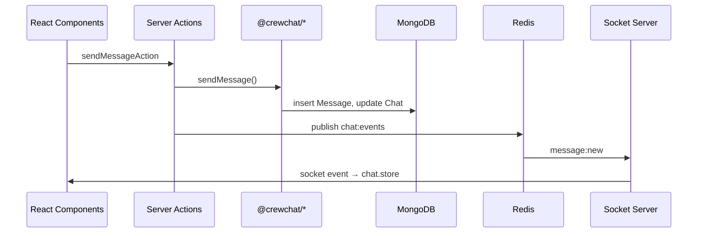

# Web App (`apps/web`)

Next.js 16 App Router application — the primary UI, authentication, server actions, and Redis publisher for realtime events.

## Tech stack

| Concern | Library |
|---------|---------|
| Framework | Next.js 16, React 19 |
| Styling | Tailwind CSS v4 |
| Auth | NextAuth v5 (JWT sessions) |
| Client state | Zustand + Immer |
| Realtime client | socket.io-client |
| Calls | WebRTC via `RTCPeerConnection` |

## App Router structure

Route groups `(auth)` and `(app)` do not appear in URLs.

```
app/
├── layout.tsx                    # Root: fonts, AuthProvider, ThemeProvider
├── (auth)/
│   └── page.tsx                  # / — login (credentials + Google)
├── (app)/
│   ├── layout.tsx                # SocketProvider, CallUI, IconRail
│   ├── chats/
│   │   ├── layout.tsx            # Split pane: ChatList + main
│   │   ├── page.tsx              # /chats
│   │   └── [chatId]/page.tsx     # /chats/:chatId
│   ├── newchat/
│   │   ├── page.tsx              # /newchat — user search
│   │   ├── [userId]/page.tsx     # /newchat/:userId — DM compose
│   │   └── group/page.tsx        # /newchat/group — group wizard
│   └── settings/
│       ├── page.tsx              # /settings
│       └── SettingsClient.tsx    # Client settings UI
└── api/
    ├── auth/[...nextauth]/route.ts
    └── socket-token/route.ts
```

### Route protection

| Route | Protection |
|-------|------------|
| `/chats/[chatId]` | Server-side `auth()` + `redirect("/")` |
| `/settings` | Server-side `auth()` + `redirect("/")` |
| `/newchat/*` | Relies on client session and action-level auth |
| `/` | Public login page |

`proxy.ts` serves as the Next.js edge-compatible entry point for request routing and authentication checks (replacing the deprecated `middleware.ts` convention in Next.js 16).

## Server actions

All actions in `lib/actions/` use `'use server'`, call `auth()` for authorization, and `connectToDB()` before database access.

### `lib/actions/user.actions.ts`

| Action | Description |
|--------|-------------|
| `searchUsersAction(query)` | Search users (min 2 chars, limit 10) |
| `getUserByIdAction(userId)` | Fetch single user |

### `lib/actions/chat.actions.ts`

| Action | Description |
|--------|-------------|
| `createDMAction(otherUserId)` | Create or return DM |
| `DMExistsAction(otherUserId)` | Check existing DM |
| `createGroupAction({ name, memberIds, imageUrl, description })` | Create group |
| `getChatsAction()` | Chat list previews |
| `getChatPreviewByIdAction(chatId)` | Single chat preview |
| `getChatDetailsByIdAction(chatId)` | Full chat details |
| `getChatMembersByIdAction(chatId)` | Member list |
| `togglePinAction` / `toggleMuteAction` | Pin/mute |
| `markChatAsReadAction(chatId)` | Clear unread |
| `changeMemberRoleAction` / `removeMemberAction` / `addMembersAction` | Group admin |
| `leaveGroupAction(chatId)` | Leave group |

### `lib/actions/message.actions.ts`

| Action | Description |
|--------|-------------|
| `sendMessageAction(chatId, content)` | Persist + Redis `message:new` |
| `getMessagesAction({ chatId, cursor?, limit? })` | Paginated history |
| `editMessageAction(messageId, content, chatId)` | Edit + Redis `message:edit` |
| `deleteMessageAction(messageId, chatId)` | Soft-delete + Redis `message:delete` |

### `lib/actions/account.actions.ts`

| Action | Description |
|--------|-------------|
| `getUserProfileDetailsAction()` | Profile for settings |
| `enablePasswordAuthentication(password)` | Hash + enable credentials |
| `disablePasswordAuthentication()` | Disable credentials |
| `updateUsername(username)` | Change username |

## Client state (Zustand)

### `store/chat.store.ts` — `useChatStore`

Central chat state with Immer middleware.

| State | Description |
|-------|-------------|
| `chatsById` | Normalized chat previews |
| `chatOrder` | Sorted IDs (pinned first, then by last message time) |
| `messagesByChatId` | Per-chat message buckets with pagination metadata |
| `activeChatId` | Currently selected chat (note: not set by components today) |
| `chatMembersByChatId` | Cached member lists |

Key actions: `setChats`, `addMessage`, `updateMessage`, `deleteMessage`, `paginateMessages`, `markChatAsRead`, `setPinned`, `setMuted`, member management.

Chat order is computed by `lib/utils/chatStoreHelpers.ts` → `computeChatOrder`.

### `store/user.store.ts` — `useUserStore`

Normalized user cache: `usersById` with `upsertUser`, `upsertUsers`, `getUserById`.

### `store/call.store.ts` — `useCallStore`

Call lifecycle: `call`, `state` (`IDLE` | `RINGING` | `CONNECTED`).

Actions: `incomingCall`, `startCall`, `connectCall`, `resumeCall`, `endCall`.

### `store/webrtc.store.ts` — `useWebRTCStore`

Signaling queue for WebRTC: `pushSignal` / `clearSignal` for offer, answer, ICE.

### `store/theme.store.ts` — `useThemeStore`

Theme mode (`light` | `dark` | `system`), persists to `localStorage`, applies `data-theme` on `<html>`.

## Components

### Providers (`components/providers/`)

| Component | Role |
|-----------|------|
| `AuthProvider` | Wraps `SessionProvider` from next-auth/react |
| `ThemeProvider` | Calls `initTheme()` on mount |
| `SocketProvider` | Socket connection, event listeners; exports `useSocket()` |

### Chat (`components/chat/`)

| Component | Role |
|-----------|------|
| `ChatList` | Loads chats, search/filter, renders items |
| `ChatListItem` | Row with long-press context menu |
| `ChatOptions` | Pin, mute, mark-read menu |
| `ChatPageLayout` | Toggles `ChatWindow` ↔ `AboutChat` |
| `ChatWindow` | Messages, infinite scroll, send/edit/delete |
| `ChatHeader` | Title bar, opens about panel |
| `MessageBubble` | Message rendering with edit/delete |
| `AboutChat` | Chat info, members, leave group |
| `MemberList` / `AddMembers` | Group member management |
| `EmptyChatState` | Desktop placeholder |

### New chat (`components/newchat/`)

| Component | Role |
|-----------|------|
| `UserSelector` | Debounced search, multi-select |
| `NewChatClient` | DM compose flow |
| `GroupInfo` | Group name, image, description |

### Calls (`components/call/`)

| Component | Role |
|-----------|------|
| `CallUI` | Orchestrator mounted in `(app)/layout.tsx` |
| `IncomingCallModal` / `OutgoingCallModal` | Ringing UI |
| `CallScreen` | Full-screen call with `useWebRTC` |
| `CallBar` | Minimized call bar |

Call initiation is wired in `UserPreview.tsx`. Buttons in `AboutChat.tsx` are UI stubs.

### Navigation (`components/navigation/`)

| Component | Role |
|-----------|------|
| `IconRail` | Server component sidebar |
| `IconRailNavigation` | Links to `/chats`, `/newchat` |

## Socket client integration

### `lib/socket.ts`

Lazy singleton Socket.IO client. `getSocket(token)` creates the instance with `autoConnect: false` and JWT in `auth.token`.

### Connection flow (`SocketProvider.tsx`)

1. Wait for `status === "authenticated"`
2. `GET /api/socket-token` → 15-minute JWT
3. `getSocket(token)` → register listeners → `socket.connect()`

See [Realtime](./REALTIME.md) for the full event catalog.

## WebRTC

### `hooks/useWebRTC.ts`

- Creates `RTCPeerConnection` with Google/Twilio STUN servers
- `getUserMedia`: audio-only for `VOICE`, audio+video for `VIDEO`
- Caller creates offer; callee handles offer → answer
- ICE candidates via `useWebRTCStore` signal queue
- Re-inits on `call.callId` or `call.rtcVersion` change (reconnect)

Returns: `localStream`, `remoteStream`, `toggleAudio`, `toggleVideo`.

## Types

| File | Exports |
|------|---------|
| `lib/types/chat.types.ts` | `ChatPreviewDTO`, `ChatDetailsDTO`, `ChatMemberDTO`, etc. |
| `lib/types/message.types.ts` | `MessageDTO` |
| `lib/types/user.types.ts` | `UserDTO`, `UserDetailsDTO` |
| `types/next.auth.d.ts` | Session/JWT augmentation (`mongoId`, `username`, `avatarUrl`) |

## Utilities

| File | Purpose |
|------|---------|
| `lib/utils/chatStoreHelpers.ts` | `computeChatOrder` |
| `lib/utils/time.ts` | `formatTime` for message timestamps |
| `lib/utils/username.ts` | `generateUniqueUsername` (Google sign-in) |
| `lib/utils/getOtherUserName.ts` | Resolve DM partner name |
| `lib/avatars.ts` | Preset avatar image paths |
| `lib/redis.ts` | Server-side Redis client for pub/sub |

## Data flow



## Seeding

```bash
cd apps/web && pnpm seed
```

Scripts in `scripts/seed/` load demo users, chats, and messages from JSON fixtures.

## Environment variables

See `apps/web/.env.local.sample`:

```
MONGODB_URI, REDIS_URL, AUTH_URL, AUTH_SECRET,
NEXT_PUBLIC_SOCKET_URL, SOCKET_JWT_SECRET,
GOOGLE_CLIENT_ID, GOOGLE_CLIENT_SECRET
```
